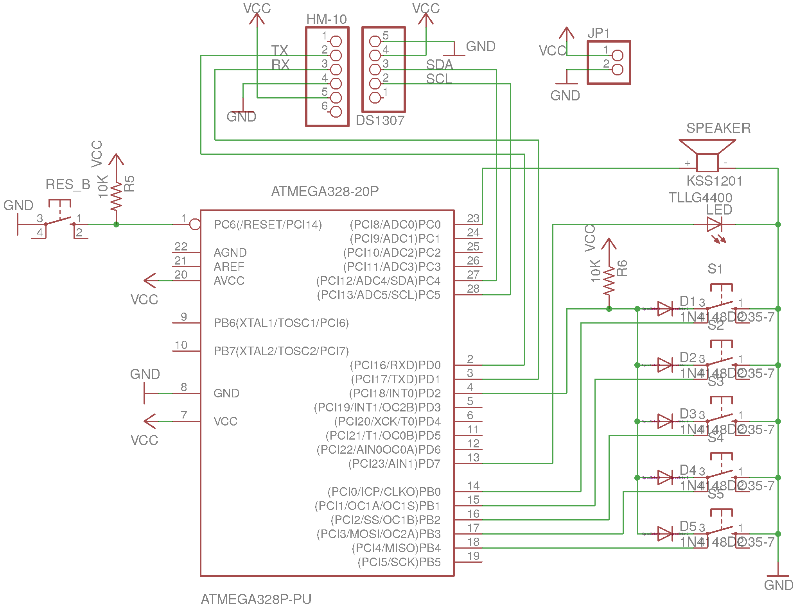

BLETKA
======
Bluetooth Low Energy Time Keeper supporting Android
---------------------------------------------------

BLETKA is device, which should provide only single button
and no other inputs. When you push this button, BLETKA will
make a sound or light effect and will save internally a record
containing current time and date.
When the button is pushed for longer time, BLETKA will
turn on its BLE module and it will provide set of commands,
which can be used to manage records and even configure
the device itself.

BLETKA was designed, created and tested on ATMEGA 328P-PU microcontroller
using HM-10 BLE module and RTC module DS1307 with 5 buttons
(instead of just single one).

The project is divided into two main parts:
  1. written in AVR assembly code
   - low level library providing interface for simple communication with all peripherals
  2. written in C code
   - program implementing the project using the assembly library
   
BLETKA circuit diagrams:
------------------------
* BLETKA with 5 buttons

   